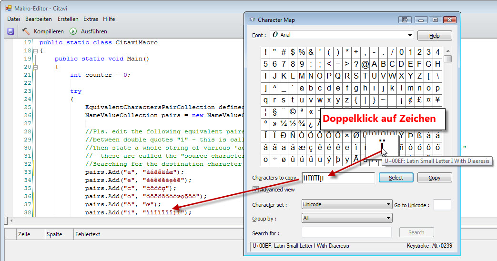

# Zeichenäquivalenztabelle ergänzen

Wenn Sie innerhalb Ihres Projekts nach Inhalten suchen, können Sie mit Hilfe der eingebauten Zeichenäquivalenz-Tabelle festlegen, dass bei der Eingabe eines bestimmten Buchstabens im Suchfeld (z. B. Ł) gleichzeitig auch ein anderer Buchstabe gesucht wird (z B. Ł). Diese Liste möchten Sie um mehrere Einträge erweitern und wünschen sich hierbei eine Unterstützung bei der Auswahl und Eingabe der Äquivalenzpaare.

## Lösung
Wir stellen ein Makro zur Verfügung, mit dem Sie mit erheblicher Zeitersparnis die Liste nach Ihren Wünschen und Bedürfnissen ergänzen können. 

## Download

[für Citavi 5 und neuer](C5+_Character_Equivalency_List.cs)

## Anwendung
Folgen Sie der Anleitung in [diesem Artikel](\readme.de.md), um das Makro einzusetzen.

Die Windows Zeichentabelle öffnen Sie, wenn Sie `Windows+R` drücken und den Befehl `charmap.exe` eingeben und mit der Eingabe-Taste abschliessen.

Im Makro stellen Sie mit Hilfe der Windows Zeichentabelle ("charmap") per Mausklick Gruppen von Zeichen zusammen, die einem einfachen lateinischen Buchstaben zugeordnet und dann bei der Verwendung dieses Buchstabens in der Suche ebenfalls berücksichtigt werden:

In der Regel brauchen Sie diese Äquivalenz nur für die Kleinbuchstaben zu definieren, da die Großbuchstaben Citavi intern automatisch mit berücksichtigt werden (das mag in Ausnahmefällen - je nach Zeichen - aber nicht funktionieren). 
 
### Anpassungsmöglichkeiten

In den **Zeilen 33ff.**  stellen Sie einzelnen, einfachen lateinischen Zeichen je eine Gruppe von entsprechenden, akzentuierten Zeichen gegenüber. Verwenden Sie die Windows Charmap, um das Zusammenstellen der Gruppen zu erleichtern.

WICHTIG: Sie können mit Hilfe des Makros z.Zt. nur Entsprechungen für einzelne Zeichen vornehmen! Entsprechungen für Zeichengruppen wie ß=ss müssen Sie weiterhin manuell aus Citavi heraus definieren.

Sie können beliebig viele Zeilen der Art `pairs.Add(...)` hinzufügen (oder bestehende Zeilen löschen bzw. mit Voranstellung von `//` auskommentieren).

In **Zeile 58** können Sie definieren, ob Sie auch eine Umkehrung der Äquivalenz konfigurieren möchten (also z.B. 'g findet auch ǧ' UND 'ǧ findet auch g'. Standardmäßig wird auch die Umkehrung konfiguriert. Wenn Sie dies nicht möchten, schreiben Sie `bool reverseEquivalency = false;`. Sie können dann immer noch in Ausnahmefällen die Umkehrung als `pairs.Add(...)` definieren.

In **Zeile 61** können Sie definieren, ob das Makro zunächst sämtliche existierenden Entsprechungen löschen soll. Standardmäßig geschieht dies nicht.
WICHTIG: Das Makro verhindert doppelte Definitionen, darum ist dies auch nicht nötig.

Wenn Sie mit den Anpassungen fertig sind, klicken Sie auf den Button **Kompilieren**. Es sollten keine Fehlermeldungen in der unteren Bildschirmhälfte des Makro-Editors auftreten. (Falls dies doch passiert und Sie die Korrekturen nicht alleine vornehmen können, schreiben Sie uns.)

Klicken Sie schließlich auf **Ausführen**. Die Zeichenäquivalenzen werden nun hinzugefügt.

## Autor
Jörg Pasch @joepasch