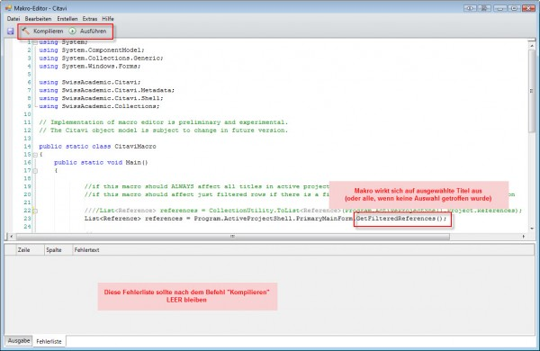

# Makros für Citavi

[[> English version](readme.md)]

## Wie führe ich unter Citavi ein Makro aus?

Makro-Dateien sind kleine Programme zur Ausführung in Citavi. Sie ermöglichen Operationen auf den Daten Ihrer Projekte, die über den Standard-Funktionsumfang von Citavi hinausgehen. Das können z.B. *Verschiebeoperationen von Feld A zu Feld B* sein oder eine *alphabetische Sortierung der Kategorien* und vieles andere mehr.

Makro-Dateien sind in der Programmiersprache C# (sprich "sii-scharp") geschrieben und bedienen sich des Citavi-Objektmodells, welches Änderungen unterworfen ist. Darum funktionieren Makros für eine frühere Version von Citavi in der Regel nicht in einer höheren Version.

Wenn Sie aus dem Forum oder vom Citavi Support eine Makro-Datei zur Ausführung unter Citavi bekommen haben, gehen Sie wie folgt vor:

1. Makro-Dateien haben die Endung `.cs`. Wenn Sie ein ZIP-File erhalten haben, entpacken Sie zunächst die Makro-Datei in einem Verzeichnis Ihrer Wahl.
1. Starten Sie Citavi und öffnen Sie das Projekt, auf welches Sie die vom Makro durchgeführte Operation anwenden wollen. 
1. **WICHTIG: Erstellen Sie ein Backup dieses Projektes**. Die Erstellung des Backups ist immens wichtig, da das Makro höchstwahrscheinlich Änderungen an den Daten in Ihrem Projekt vornimmt und diese Änderungen nicht einfach rückgängig gemacht werden können.
1. Viele Makros erlauben es, die damit verbundene Operation nur auf eine Auswahl der Titel anzuwenden und nicht auf alle Titel des Projektes (Sie erkennen dies daran, dass im Programmcode - siehe unten - ein Befehl mit der Endung `.GetFilteredReferences()` verwendet wird). In diesem Fall treffen Sie nun noch in Citavi eine Auswahl an Titeln (z.B. mit den Filter- oder Suchfunktionen). Wenn Sie keine Auswahl treffen, wird die Operation auf alle Titel angewendet.
1. Starten Sie sodann den Makro-Editor mit Hilfe der Tastenkombination `Alt+F11` (oder über **Extras > Makro-Editor**). Der Start des Makro-Editors kann einige Sekunden Zeit in Anspruch nehmen.

1. Im Makro-Editor laden Sie die oben entpackte .cs-Datei über **Datei > Öffnen**.
1. Klicken Sie in der Toolbar auf **Kompilieren**. Im unteren Bildschirmbereich sollten keine Fehlermeldungen erscheinen.
1. Klicken Sie schließlich in der Toolbar auf **Ausführen**, um die Operation durchzuführen (**Wichtig:** Sie müssen nochmals bestätigen, dass Sie zuvor ein Backup erstellt haben. Falls dem nicht so ist, klicken Sie auf **Cancel** und holen Sie das an dieser Stelle bitte nach!)

## Support

Bei Fragen, Anmerkungen oder Wünschen kontaktieren Sie bitte den [Support](https://www.citavi.com/de/support/uebersicht) direkt

## Lizenz

Dieses Projekt ist lizensiert unter der [MIT](LICENSE) Lizenz

